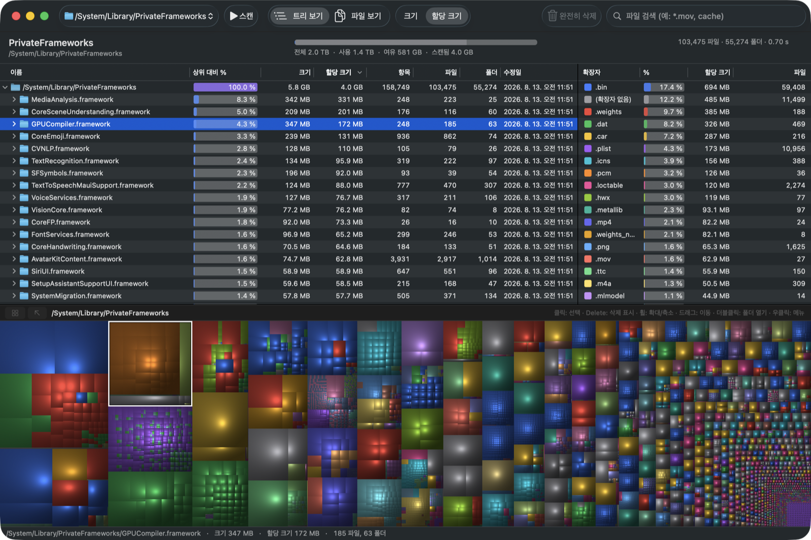

# MacTree

[](https://github.com/aodjo/macTree/actions/workflows/build.yml)
[](https://github.com/aodjo/macTree/releases/latest)
[](LICENSE)

디스크 공간을 어디에 쓰고 있는지 한눈에 보여주는 macOS용 디스크 분석기입니다.
Windows의 WizTree처럼 디스크 전체를 빠르게 스캔하고, 폴더 트리·파일 목록·쿠션 트리맵으로 보여줍니다.



## 주요 기능

- **빠른 스캔**: 여러 스레드가 동시에 폴더를 읽습니다. M5 Pro Mac에서 부트 디스크 전체(약 670만 항목)를 약 25초에 스캔했습니다.
- **트리 보기**: 폴더와 파일을 계층으로 보여줍니다. 열은 상위 대비 %, 크기, 할당 크기, 항목·파일·폴더 수, 수정일이고, 열 머리글을 누르면 정렬됩니다.
- **파일 보기**: 모든 파일을 크기순으로 한 목록에 보여줍니다. 이름 검색과 와일드카드를 지원합니다.
- **확장자별 통계**: 확장자마다 합계와 파일 수를 트리맵과 같은 색으로 보여줍니다. 선택하면 트리맵에서 해당 형식만 강조되고, 더블클릭하면 그 형식의 파일만 모아 봅니다.
- **쿠션 트리맵**: 휠이나 핀치로 포인터 위치를 중심으로 확대합니다(최대 10,000배). 확대할수록 작은 파일까지 드러납니다.
- **삭제**: 휴지통으로 보내거나, 여러 항목을 표시해 두었다가 한 번에 완전히 삭제할 수 있습니다.
- **크기 / 할당 크기 전환**: 기본값은 실제로 디스크를 차지하는 할당 크기라서, Docker 이미지 같은 희소 파일이나 iCloud에만 있는 파일에 속지 않습니다.
- **그 밖에**: 훑어보기(Quick Look), 폴더 하나만 다시 스캔, CSV 내보내기, 한국어·영어 UI.

## 설치

macOS 15(Sequoia) 이상, Apple 실리콘과 Intel Mac을 모두 지원합니다.

### Homebrew

```sh
brew install --cask aodjo/tap/mactree
```

`mactree` 명령도 함께 설치됩니다. [명령줄](#명령줄)을 참고하세요.

### 직접 내려받기

[Releases](https://github.com/aodjo/macTree/releases/latest)에서 `MacTree-vX.Y.Z.zip`을 내려받아 압축을 풀고, `MacTree.app`을 응용 프로그램 폴더로 옮기면 됩니다.
Developer ID로 서명하고 Apple 공증을 받은 빌드라서 바로 열립니다.

## 전체 디스크 접근 권한

권한이 없으면 macOS가 메일, 메시지, Safari, 다른 앱의 데이터 같은 폴더를 숨깁니다. 데스크탑·문서·다운로드 폴더는 읽기 전에 따로 허용을 묻습니다.
정확한 결과를 보려면 **전체 디스크 접근 권한**을 허용해 주세요.

1. 처음 실행하면 안내 창이 뜹니다. **시스템 설정 열기**를 누릅니다.
2. 목록에서 MacTree를 켭니다. 목록에 없으면 안내 창의 아이콘을 목록으로 끌어다 놓습니다.
3. MacTree가 허용된 것을 자동으로 감지합니다. 다시 시작하라는 안내가 나오면 **MacTree 다시 시작**을 누릅니다.

안내 창은 메뉴 **MacTree › 전체 디스크 접근 권한…**에서 언제든 다시 열 수 있습니다.

> 권한을 허용해도 macOS가 보호하는 폴더(시스템 무결성 보호)나 관리자(root) 전용 시스템 폴더 수백 개는 읽을 수 없습니다. 이 폴더들은 "시스템 보호 폴더 N개 제외됨"으로 따로 표시되고, 누르면 목록을 볼 수 있습니다.

## 사용법

### 스캔

툴바의 위치 목록에서 볼륨이나 폴더를 고르면 바로 스캔합니다. 다른 폴더를 스캔하려면 **폴더 선택…**(⌘O)을 누릅니다.

### 트리맵

| 조작 | 동작 |
| --- | --- |
| 클릭 | 항목 선택 (트리에서도 같이 선택됨) |
| 휠 / 핀치 | 포인터 위치를 중심으로 확대·축소 |
| 드래그 | 확대한 상태에서 이동 |
| 더블클릭 | 그 폴더만 트리맵으로 보기 |
| 우클릭 | 메뉴 (열기, Finder에서 보기, 다시 스캔, 휴지통 등) |

폴더 전체 보기에서 더 축소하면 상위 폴더로 올라갑니다. 트리맵 위쪽에는 지금 화면을 채우고 있는 폴더와 확대 배율이 표시됩니다.

### 파일 검색

툴바 검색창은 파일 보기의 목록을 거릅니다.

| 입력 | 뜻 |
| --- | --- |
| `cache` | 이름에 `cache`가 들어간 파일 (대소문자 무시) |
| `*.mov` | 확장자가 `mov`인 파일 |
| `IMG_????.HEIC` | 와일드카드 (`*`, `?`, `[ ]`) |
| `*.mov; *.mp4` | 여러 조건 중 하나 (`;` 또는 `\|`로 구분) |

### 삭제

- **휴지통으로 이동**: 항목을 선택하고 ⌘⌫을 누릅니다.
- **완전히 삭제**: 항목을 선택하고 Delete를 누르면 빨간 테두리로 삭제 대상이 표시됩니다. 트리맵, 트리 목록, 파일 목록 어디서든 되고, 한 번 더 누르면 해제됩니다. 표시가 끝나면 검색창 왼쪽의 **완전히 삭제 (N)**을 누릅니다. 확인 창에서 한 번 더 확인하면 휴지통을 거치지 않고 바로 삭제되며, 되돌릴 수 없습니다.

### 단축키

| 키 | 동작 |
| --- | --- |
| ⌘O | 폴더 스캔 |
| ⌘R | 다시 스캔 |
| ⌘. | 스캔 중지 |
| ⌘1 / ⌘2 | 트리 보기 / 파일 보기 |
| ⌘F | 파일 검색 |
| Space | 훑어보기 |
| ⇧⌘R | Finder에서 보기 |
| ⌥⌘C | 경로 복사 |
| Delete | 삭제 대상으로 표시 / 해제 |
| ⌘⌫ | 휴지통으로 이동 |
| ⌘↑ / ⌘0 | 트리맵 축소 / 전체 보기 |
| ⌘E | CSV로 내보내기 |

## 명령줄

Homebrew로 설치했다면 `mactree`, 직접 설치했다면 `/Applications/MacTree.app/Contents/MacOS/MacTree`로 실행합니다.

```sh
mactree --scan ~/Downloads          # 앱을 열고 바로 스캔
mactree --export / scan.csv         # 창 없이 스캔해서 CSV로 저장
mactree --bench /Applications       # 스캔 시간과 큰 폴더 출력
```

CSV에는 모든 폴더와 파일의 경로, 종류, 크기, 할당 크기, 파일·폴더 수, 수정일이 들어갑니다.

## 성능

Apple M5 Pro Mac에서 측정했습니다.

| 대상 | 항목 수 | 시간 |
| --- | --- | --- |
| `/Applications` | 약 123만 | 약 3초 |
| 부트 디스크 전체 (`/`) | 약 670만 | 약 25초 |

부트 디스크 전체를 스캔할 때 메모리는 약 1.2GB를 썼습니다. `/Applications`의 합계는 `du`와 0.1% 이내로 일치했습니다.

## 동작 방식

- `getattrlistbulk(2)`로 폴더 하나의 항목과 크기를 한 번의 시스템 호출로 읽고, 최대 16개 스레드가 폴더를 나눠서 읽습니다.
- 부트 볼륨에서는 APFS 펌링크(`/Users` 등)를 한 번만 셉니다. 스캔한 위치가 속한 APFS 컨테이너 밖으로는 나가지 않아서 외장 디스크나 네트워크 볼륨은 따로 스캔해야 합니다.
- iCloud에만 있는 파일(dataless)은 스캔 중에 내려받지 않습니다.

## 빌드

macOS 15 이상이 필요하고, Xcode 26(Swift 6.2 이상)에서 빌드를 확인했습니다. 외부 의존성은 없습니다.

```sh
./scripts/build-app.sh              # build/MacTree.app
UNIVERSAL=1 ./scripts/build-app.sh  # Apple 실리콘 + Intel 유니버설
```

키체인에 "Apple Development" 인증서가 있으면 그 인증서로, 없으면 ad-hoc으로 서명합니다. `SIGN_IDENTITY`로 인증서를 직접 고를 수 있습니다.

릴리스는 `main`에서 아래 명령 하나로 만듭니다. 태그를 만들고, 유니버설로 빌드해 Developer ID로 서명하고, Apple 공증과 스테이플을 거쳐 GitHub 릴리스에 올린 뒤, Homebrew cask에 넣을 SHA-256을 출력합니다.

```sh
scripts/release.sh v1.2.3
```

처음 한 번은 공증용 인증 정보를 키체인에 저장해야 합니다.

```sh
xcrun notarytool store-credentials macTree --apple-id <Apple ID> --team-id <Team ID>
```

## 라이선스

[Apache License 2.0](LICENSE)을 따릅니다. 저작권 표시는 [NOTICE](NOTICE)에 있습니다.

WizTree는 Antibody Software의 제품이며, MacTree는 WizTree와 관련이 없는 별개의 프로젝트입니다.
